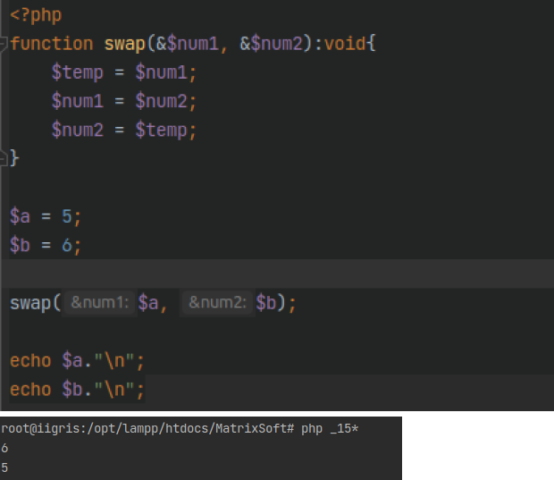
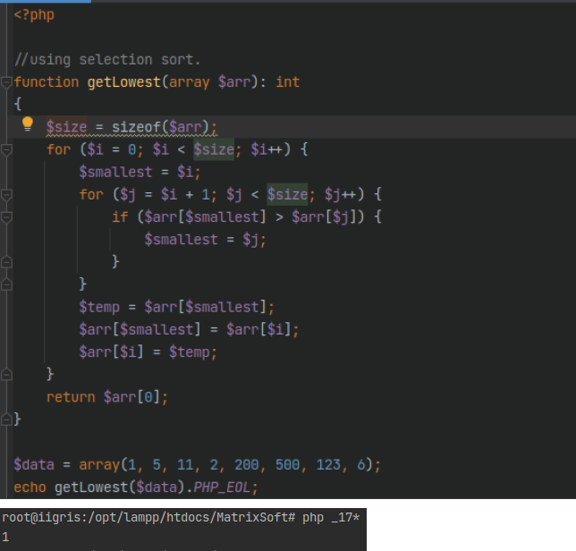

# Pre-requisites:

- php v8.0+
- terminal
<hr>

# How to view:

- ## Using the index.php file

  - run the 'index.php' script in a terminal and view results for each question/task
  - ```
    php index.php
    ```

- ## Manually running each file

  - run each file in the terminal
  - for ease, the filenames have an incremental prefix
  - ```
    php _01*
    ```
  - change the \_01\* to any question number you wan, example:
    - ```
      php _02*
      ```
    - ```
      php _03*
      ```

- ## View the screenshots
  - I've slightly manipulated the images below so that the viewing experience is not boring.
  - Un-altered images can be found <a href="../screenshots">HERE</a>
  <hr>

# Screenshots

- ## QN1: Factorial
- 

- ## QN2: Fibonacci
- 

- ## QN3: Armstrong
- 

- ## QN4: Reverse
- 

- ## QN5: Descending
- 

- ## QN6: Prime Or Not
- 

- ## QN7: HCF
- 

- ## QN8: Leap year or not
- 

- ## QN9: Reverse Numeric Triangle
- 

- ## QN10: Normal Star Triangle
- 

- ## QN11: Normal Numeric Triangle
- 

- ## QN12: Factors of a number
- 

- ## QN13: Multiplication table
- 

- ## QN14: Highest in an array
- 

- ## QN15: Swap two numbers
- 

- ## QN16: Bubble sort
- 

- ## QN17: Smallest in an array
- 

- ## QN18: 4 interval Rectangle matrix
- 

- ## QN19: Hollow Rectangle
- 

- ## QN20: Pattern with 0 at end
- 

- ## QN21: Floyd's Triangle
- 

- ## QN22: Weird Concat
- 

- ## QN23: LCM
- 

- ## QN24: Second Highest number in array
- 
